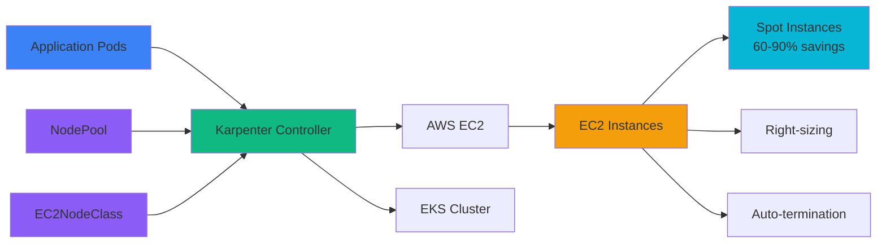

<div class="backdrop-blur-sm bg-slate-900/70 border border-white/30 p-6 rounded-2xl max-w-4xl mx-auto">
<h1 class="!text-5xl font-bold text-white mb-4">From 40% Savings to Smart Scaling</h1>
<h2 class="text-lg text-gray-100">Mastering Cost Optimization with Karpenter</h2>
</div>

<div class="backdrop-blur-sm bg-slate-900/60 border border-white/20 p-8 rounded-2xl max-w-3xl mx-auto mt-16">
  <div class="text-sm text-gray-300">
    Luca Becker • Principal Consultant @TNG • Munich Kubernetes Meetup 2025
  </div>
</div>


<!--
Welcome to our presentation on Kubernetes + Karpenter Auto-scaling. Today we'll explore how to build cost-effective infrastructure that scales intelligently with your workloads.
-->

---
layout: default
class: 'bg-black'
---

# Real-World Case Study

<div class="text-white font-bold text-2xl mb-6">Anthropic: ~40% AWS bill reduction</div>

<div class="border-l-4 border-green-400 p-6 mb-4">
<div class="text-white italic text-lg">
"Year-over-year we had a 40% cost reduction over using on-demand instances by being able to utilize flexible instance types in Karpenter."
</div>
<div class="text-green-300 text-sm mt-3">— Nova DasSarma, Lead Engineer at Anthropic</div>
</div>

<div class="absolute bottom-4 right-4 text-xs text-slate-400">
Source: <a href="https://www.thestack.technology/aws-anthropic-cloud-bill-eks-karpenter/" target="_blank" class="text-slate-300 underline">The Stack</a>
</div>

---
layout: default
background: linear-gradient(135deg, #1e293b 0%, #374151 100%)
---

# The Infrastructure Cost Problem

<div class="grid grid-cols-2 gap-8 mt-8">

<div>

<v-clicks>

<div class="bg-gradient-to-br from-red-50 to-red-100 rounded-2xl p-5 border-2 border-red-200">

### <span class="text-red-700">Traditional Approach</span>

<div class="bg-white p-3 rounded-lg mt-3">

```yaml
# Always-on cluster nodes
nodes:
  - type: m5.2xlarge
    cost: $0.384/hour (~$250/month)
    utilization: ~25%
    waste: 75%
```

</div>

</div>

<div class="bg-gradient-to-br from-blue-50 to-blue-100 rounded-2xl p-5 border-2 border-blue-200 mt-4">

### <span class="text-blue-700">What if we could:</span>

<ul class="my-0 space-y-1 list-none">
<li>Pay only for what we use</li>
<li>Auto-scale with 60-90% savings</li>
</ul>

</div>

</v-clicks>

</div>

<div>

<v-click>

<div class="bg-gradient-to-br from-orange-50 to-orange-100 rounded-2xl p-5 border-2 border-orange-200">

### <span class="text-orange-700">Industry Reality</span>

<ul class="my-0 space-y-1 list-none">
<li>
  Managing cloud spending is the #1 challenge
</li>
<li>
  29% spend over $12M annually on cloud
</li>
<li>
  89% use multi-cloud but lack expertise
</li>
</ul>

<div class="bg-white p-3 rounded-lg mt-3">
<div class="text-xs text-gray-600 italic">
Source: Flexera 2024 State of the Cloud Report
</div>
</div>

</div>

</v-click>

</div>

</div>

<!--
This slide illustrates the fundamental problem - traditional approaches keep expensive resources running 24/7 with very low utilization.
-->

---
layout: default
---

# Traditional Auto-scaling: Why It's Broken

<div class="grid grid-cols-2 gap-8">

<div>

## **Cluster Autoscaler Limitations**

<v-clicks>

<div class="space-y-2 mt-4">
<div class="bg-gradient-to-br from-red-50 to-red-100 rounded-xl p-2 border-2 border-red-200">
  <div class="text-sm">
    <div class="font-bold flex items-center gap-1 text-red-700">
      <span>🐌</span>
      <span>Slow & Unresponsive</span>
    </div>
    <div class="text-gray-700 text-xs mt-1">2-10 min provisioning delays</div>
  </div>
</div>

<div class="bg-gradient-to-br from-orange-50 to-orange-100 rounded-xl p-2 border-2 border-orange-200">
  <div class="text-sm">
    <div class="font-bold flex items-center gap-1 text-orange-700">
      <span>🔒</span>
      <span>Rigid Node Groups</span>
    </div>
    <div class="text-gray-700 text-xs mt-1">Pre-defined instance types can't adapt</div>
  </div>
</div>

<div class="bg-gradient-to-br from-yellow-50 to-yellow-100 rounded-xl p-2 border-2 border-yellow-200">
  <div class="text-sm">
    <div class="font-bold flex items-center gap-1 text-yellow-700">
      <span>📦</span>
      <span>Poor Resource Matching</span>
    </div>
    <div class="text-gray-700 text-xs mt-1">4GB pod on 16GB node = 75% waste</div>
  </div>
</div>

<div class="bg-gradient-to-br from-gray-50 to-gray-100 rounded-xl p-2 border-2 border-gray-200">
  <div class="text-sm">
    <div class="font-bold flex items-center gap-1 text-gray-700">
      <span>⚙️</span>
      <span>Operational Burden</span>
    </div>
    <div class="text-gray-700 text-xs mt-1">Managing dozens of node groups</div>
  </div>
</div>
</div>

</v-clicks>

</div>

<div>

<v-click>

## **The Cost Impact**

<div class="space-y-4 mt-4">

<div class="bg-gradient-to-br from-red-50 to-red-100 rounded-xl p-4 border-2 border-red-200">
<div class="font-bold text-base flex items-center gap-2 text-red-700">
<span>💸</span>
<span>The Real Cost</span>
</div>
<div class="text-gray-700 text-sm mt-2 space-y-1">
<div>30-50% compute underutilization</div>
<div class="font-semibold text-red-600">$100K wasted per $300K annual spend</div>
</div>
</div>

<div class="bg-gradient-to-br from-orange-50 to-orange-100 rounded-xl p-4 border-2 border-orange-200">
<div class="font-bold text-base flex items-center gap-2 text-orange-700">
<span>⚡</span>
<span>The Business Pain</span>
</div>
<div class="text-gray-700 text-sm mt-2 space-y-1">
<div>Failed deployments during scale events</div>
<div>Engineers managing infrastructure vs. building</div>
</div>
</div>

</div>

</v-click>

</div>

</div>

---
layout: center
class: text-center
---

<div class="max-w-6xl mx-auto">

<div class="mb-6">

</div>

<div class="bg-slate-900/80 backdrop-blur-md p-4 rounded-2xl mb-8 max-w-2xl mx-auto border border-blue-400/50">
<div class="text-xl font-semibold text-white mb-2">Kubernetes-native node provisioner</div>
<div class="text-gray-200">Intelligent infrastructure that adapts to your workloads</div>
</div>

<v-clicks>

<div class="grid grid-cols-2 gap-8 mt-8">

<div class="bg-gradient-to-br from-green-50 to-green-100 rounded-2xl p-5 border-2 border-green-200">

## <span class="text-green-700">✨ Key Features</span>

<ul class=" space-y-1 list-none">
<li>60s provisioning</li>
<li>Right-sized instances</li>
<li>Spot optimization</li>
</ul>

</div>

<div class="bg-gradient-to-br from-purple-50 to-purple-100 rounded-2xl p-5 border-2 border-purple-200">

## <span class="text-purple-700">🎯 Perfect For Modern Apps</span>

<ul>
<li>Zero idle costs</li>
<li>Auto-scaling</li>
<li>Production-ready</li>
</ul>

</div>

</div>

</v-clicks>

</div>

<!--
Karpenter solves the core problems we just discussed. It's purpose-built for modern, dynamic workloads.
-->

---
layout: default
background: linear-gradient(135deg, #1e293b 0%, #0f172a 100%)
---

# Architecture Overview

<div class="grid grid-cols-3 gap-6 mt-2">

<div class="col-span-2">



</div>

</div>

<v-click>

<div class="bg-gradient-to-br from-green-50 to-green-100 rounded-2xl p-5 border-2 border-green-200 mt-6 max-w-2xl mx-auto">

## <span class="text-green-700">The Magic Formula</span>

<div class="grid grid-cols-3 gap-3 text-sm mt-3">
<div class="bg-white p-3 rounded-lg text-center">
  <div class="font-bold">$0 Idle Costs</div>
  <div class="text-gray-600">No pre-provisioned nodes</div>
</div>

<div class="bg-white p-3 rounded-lg text-center">
  <div class="font-bold">60-Second Provisioning</div>
  <div class="text-gray-600">When workloads arrive</div>
</div>

<div class="bg-white p-3 rounded-lg text-center">
  <div class="font-bold">30-Second Cleanup</div>
  <div class="text-gray-600">When workloads finish</div>
</div>
</div>

</div>

</v-click>

<!--
This slide explains Karpenter's architecture and key value proposition:

1. **The Flow**: Application Pods → Karpenter Controller → AWS EC2
   - When pods are pending, Karpenter detects them
   - Controller evaluates NodePool/EC2NodeClass requirements
   - Provisions optimal EC2 instances automatically

2. **The Magic Formula**: 
   - Start with $0 costs (no idle nodes)
   - Scale up in 90 seconds when needed
   - Scale down in 30 seconds when workloads finish
   - Result: Pay only for actual usage

3. **Key Insight**: Karpenter acts as an intelligent bridge between your Kubernetes workloads and AWS infrastructure, making cost-optimal decisions automatically.

Teaching points:
- Contrast with always-on approaches
- Emphasize the speed (90s vs traditional 10+ minutes)
- Highlight the zero idle cost model
- Show that it's native Kubernetes, not external tooling
-->

---
layout: two-cols
layoutClass: gap-16
---

# NodePool

```yaml {all|1-4|5-11|12-14|15-17|18-19|all}
apiVersion: karpenter.sh/v1
kind: NodePool
metadata:
  name: general-nodepool
spec:
  template:
    spec:
      requirements:
        - key: node.kubernetes.io/instance-type
          operator: In
          values: ["m5.large", "m5.xlarge", "c5.xlarge"]
        - key: karpenter.sh/capacity-type
          operator: In
          values: ["spot", "on-demand"]
      taints:
        - key: workload-type
          effect: NoSchedule
  disruption:
    consolidateAfter: 30s
```

::right::

<v-click>

### Defines Compute Requirements

**Key Properties:**
- **Instance Types**: Which EC2 instances to use
- **Capacity Type**: Spot vs on-demand preference  
- **Limits**: Maximum resource allocation
- **Disruption**: When to consolidate nodes

**What NodePool Does:**
- Tells Karpenter what kinds of nodes you want
- Sets taints for workload isolation
- Controls cost optimization through spot instances
- Manages scaling behavior and limits

</v-click>

<!--
NodePool defines the logical compute requirements for your workloads.
-->

---
layout: two-cols
layoutClass: gap-16
---

# EC2NodeClass

```yaml {all|1-4|5-10|11-15|all}
apiVersion: karpenter.k8s.aws/v1
kind: EC2NodeClass
metadata:
  name: general-nodeclass
spec:
  amiFamily: AL2
  instanceProfile: KarpenterNodeProfile
  subnetSelectorTerms:
    - tags:
        karpenter.sh/discovery: "my-cluster"
  blockDeviceMappings:
    - deviceName: /dev/xvda
      ebs:
        volumeSize: 50Gi
        volumeType: gp3
```

::right::

<v-click>

### 🔧 Handles AWS Infrastructure Details

**Key Properties:**
- **AMI Family**: Base operating system image
- **Instance Profile**: IAM permissions for nodes
- **Subnets**: Network placement and discovery
- **Storage**: EBS volume configuration

**What EC2NodeClass Does:**
- Configures networking and subnet placement  
- Sets up IAM permissions and security
- Defines storage volumes and encryption
- Selects the base AMI for instances

</v-click>

<!--
EC2NodeClass handles the AWS-specific infrastructure configuration.
-->

---
layout: center
class: text-center bg-gradient-to-br from-blue-800 via-blue-500 to-blue-400
---

<div class="max-w-5xl mx-auto">

# <span class="text-white font-bold text-6xl drop-shadow-lg">🎬 Live Demo Time!</span>


<div class="bg-gradient-to-br from-blue-50 to-blue-100 rounded-2xl p-5 border-2 border-blue-200 mb-6 max-w-3xl mx-auto">

## <span class="text-blue-700">Ready for Action</span>

<strong>Let's see Karpenter in action with real workloads</strong>

</div>
</div>

<!--
Time for the exciting part - let's see this in action! Open your terminals and let's dive in.
-->

---
layout: two-cols
layoutClass: gap-8
---

# Demo: Initial State

```bash
$ kubectl get nodes
NAME                       STATUS   ROLES
ip-10-0-1-100.ec2.internal Ready    control-plane

$ kubectl get pods | grep workload
No resources found

$ ./scripts/check-worker-costs.sh
Checking actual worker node costs for cluster: karpenter-demo
Current worker nodes: 0
Current worker node cost: $0.00/hour (no running instances)
```


### 🎯 Perfect Starting Point
- Only control plane nodes running
- Zero costs for worker node capacity
- Ready to scale on-demand


::right::

<v-click>

# Deploy CPU Workload

```bash
$ kubectl scale deployment/cpu-workload-simulator --replicas=3

$ kubectl get pods -w
NAME                              STATUS    
cpu-workload-simulator-xxx-xxx   Pending   
cpu-workload-simulator-yyy-yyy   Pending  
cpu-workload-simulator-zzz-zzz   Pending
# Pods are pending - they need worker nodes!
```


### What Happens Next?
1. Karpenter detects pending pods
2. Evaluates NodePool requirements  
3. Provisions appropriate EC2 instances
4. Pods get scheduled automatically

</v-click>

<!--
This shows the beauty of Karpenter - we start with zero cost and scale only when needed.
-->

---
layout: default
---

# ⚡ Demo: Scale Up

```bash {1-2|4-11|all}
$ kubectl scale deployment/cpu-workload-simulator --replicas=6
deployment.apps/cpu-workload-simulator scaled

$ kubectl get pods -w
NAME                              STATUS    
cpu-workload-simulator-xxx-xxx   Pending   
cpu-workload-simulator-yyy-yyy   Pending  
cpu-workload-simulator-zzz-zzz   Pending
cpu-workload-simulator-aaa-aaa   Pending
cpu-workload-simulator-bbb-bbb   Pending
cpu-workload-simulator-ccc-ccc   Pending
```

<v-click>

### Karpenter Detection Process
1. Detecting pending pods that need resources
2. Calculating optimal node types and sizes  
3. Initiating EC2 provisioning based on requirements
4. New nodes will be available shortly

</v-click>

<!--
Scaling up triggers Karpenter's intelligent provisioning process.
-->

---
layout: default
---

# ⚡ Demo: Karpenter in Action

````md magic-move {lines: true}
```bash {1-2}
$ watch 'kubectl get nodes -o wide'
# Watching for new nodes...
```

```bash {1-6}
$ watch 'kubectl get nodes -o wide'
# Karpenter logs show:
INFO  Created node for NodePool general-nodepool
INFO  Launching instance m5.xlarge (spot) 
INFO  Node worker-node-abc123 ready
```

```bash {1-10}
$ kubectl get nodes -l karpenter.sh/nodepool
NAME                  STATUS   AGE   INSTANCE-TYPE
worker-node-abc123    Ready    2m    m5.xlarge
worker-node-def456    Ready    2m    c5.large

$ kubectl get pods -o wide | grep cpu
cpu-workload-simulator-xxx   Running   worker-node-abc123
cpu-workload-simulator-yyy   Running   worker-node-def456  
cpu-workload-simulator-zzz   Running   worker-node-abc123
```
````

<v-click>

## 🎉 **Nodes provisioned automatically in ~2 minutes!**

- ✅ Right instance types chosen automatically
- ✅ Spot instances preferred for cost savings
- ✅ Pods scheduled efficiently across nodes
- ✅ Zero manual intervention required

</v-click>

<!--
This is the magic moment - watching nodes appear exactly when needed, with the right configuration.
-->

---
layout: center
class: text-center
---

# 📉 The Magic Scale-Down

````md magic-move {lines: true}
```bash
$ kubectl scale deployment/cpu-workload-simulator --replicas=0
```

```bash
$ kubectl scale deployment/cpu-workload-simulator --replicas=0

# After 30 seconds...
$ kubectl get nodes -l karpenter.sh/nodepool
NAME                STATUS        AGE
worker-node-abc123  Terminating   6m
worker-node-def456  Terminating   6m  
worker-node-ghi789  Terminating   2m
worker-node-jkl012  Terminating   2m
```

```bash
$ kubectl scale deployment/cpu-workload-simulator --replicas=0

# After 5 minutes...
$ kubectl get nodes -l karpenter.sh/nodepool
No resources found

$ ./scripts/check-worker-costs.sh
Checking actual worker node costs for cluster: karpenter-demo
Current worker nodes: 0
Current worker node cost: $0.00/hour (no running instances)
```
````

<v-click>

## 🎉 **Back to $0/hour worker node costs automatically!**

</v-click>

<!--
This is the cost optimization in action - automatic scale-down when workloads are no longer needed.
-->

---
layout: default
background: linear-gradient(135deg, #0f172a 0%, #1e293b 100%)
class: cost-contrast-fix
---

# <span class="text-white" aria-hidden="true">💰</span> Cost Analysis: Before vs After

<div class="grid grid-cols-2 gap-6 mt-6">

<div class="bg-gradient-to-br from-red-50 to-red-100 rounded-2xl p-5 border-2 border-red-200">

## <span class="text-red-700">❌ Before Karpenter</span>

<ul class="my-0 space-y-2 list-none">
<li>💸 <strong>Always-on nodes:</strong> $500–800/month per instance</li>
<li>📉 <strong>Low utilization:</strong> ~25% average</li>
<li>📊 <strong>Over-provisioning:</strong> Capacity for peak demand</li>
<li>🐌 <strong>Manual scaling:</strong> Slow response to demand</li>
</ul>

</div>

<div class="bg-gradient-to-br from-green-50 to-green-100 rounded-2xl p-5 border-2 border-green-200">

## <span class="text-green-700">✅ After Karpenter</span>

<ul class="my-0 space-y-2 list-none">
<li>💰 <strong>On-demand billing:</strong> Pay only when needed</li>
<li>📈 <strong>80–90% utilization:</strong> When running</li>
<li>🏷️ <strong>Spot savings:</strong> Up to 70%</li>
</ul>

<div class="bg-white p-3 rounded-lg mt-3">
<strong>Result:</strong> 60-80% cost reduction with better performance
</div>

</div>
</div>

<!--
The numbers speak for themselves - this is real money saved that can be reinvested in innovation.
-->

<!-- After card merged into previous slide -->

---
layout: default
---

# Production Best Practices

<div class="grid grid-cols-2 gap-6 mt-4">

<div>

### **Reliability**
<v-clicks>

- **Mix spot + on-demand** for critical workloads
```yaml
values: ["spot", "on-demand"]  # Prefer spot, fallback on-demand
```

- **Multiple instance types** for availability
```yaml
values: ["m5.xlarge", "c5.xlarge", "r5.xlarge"]
```

- **Proper taints/tolerations** for workload isolation
```yaml
taints:
  - key: workload-type
    effect: NoSchedule
```

</v-clicks>

</div>

<div>

### **Cost Optimization**
<v-clicks>

- **Enable spot instances** with interruption handling
- **Use multiple AZs** and instance families
- **Set appropriate consolidateAfter** values (30s for dev, 60s for prod)

</v-clicks>

<v-click>

### **Monitoring**
- Track **node provisioning time** (p95, p99)
- Alert on **spot interruption rates**

</v-click>

</div>

</div>

<!--
These practices ensure your Karpenter setup is production-ready and reliable.
-->

---
layout: center
class: text-center
---

# 🎯 When to Use Karpenter

<div class="grid grid-cols-2 gap-12 mt-8">

<div>

## **Perfect For:**
<div class="text-left space-y-3 mt-6">
<v-clicks>

✅ **Variable workloads**  
✅ **Batch processing jobs**  
✅ **Development/testing environments**  
✅ **Cost-sensitive applications**  
✅ **Multi-tenant platforms**  
✅ **Spot instance workloads**  

</v-clicks>
</div>

</div>

<div>

## **Consider Alternatives When:**
<div class="text-left space-y-3 mt-6">
<v-clicks>

❌ **Extremely latency-sensitive** (< 90s startup)  
❌ **Requires specific hardware** configurations  
❌ **Legacy applications** with hard node requirements  
❌ **Always-on, predictable** workloads  
❌ **Compliance requires** pre-provisioned resources  

</v-clicks>
</div>

</div>

</div>

<v-click>

<div class="bg-gradient-to-br from-green-50 to-green-100 rounded-2xl p-5 border-2 border-green-200 mt-12">

## <span class="text-green-700">💡 Decision Framework</span>

<div class="bg-white p-3 rounded-lg mt-3">
If your workloads have <strong>variable patterns</strong> and you care about <strong>cost optimization</strong>, Karpenter is likely a great fit.
</div>

</div>

</v-click>

<!--
Understanding when Karpenter fits helps you make the right architectural decisions.
-->

---
layout: default
---

# 🚀 Getting Started

<div class="grid grid-cols-2 gap-16 h-full items-start pt-8">

<div>

### **1. Try the Demo**
```bash
git clone https://github.com/lucavb/k8s-meetup-talk-2025-09-09
cd k8s-meetup-talk-2025-09-09/aws-demo  
./scripts/deploy.sh
# Takes ~15 minutes to set up everything
```

<v-click>

### **2. Key Resources**
- 📖 [Karpenter Documentation](https://karpenter.sh)
- 🛠️ [AWS EKS Best Practices](https://docs.aws.amazon.com/eks/latest/best-practices/introduction.html)
- 💡 [This Demo Repo](https://github.com/lucavb/k8s-meetup-talk-2025-09-09)
- 🎯 [Karpenter Slack Community](https://kubernetes.slack.com/channels/karpenter)

</v-click>

</div>

<div class="flex flex-col justify-center">
<v-click>

### **3. Migration Guide**

<div class="space-y-4 text-sm">

**From Cluster Autoscaler:**
1. Install Karpenter alongside CA
2. Create NodePools for new workloads  
3. Gradually migrate node groups
4. Remove Cluster Autoscaler

**From Managed Node Groups:**
1. Deploy Karpenter + NodePools
2. Drain & delete old node groups
3. Let Karpenter handle scaling

</div>

</v-click>

</div>

</div>


<!--
A practical roadmap for getting started and measuring success.
-->

---
layout: center  
class: text-center
background: linear-gradient(135deg, #0f172a 0%, #1e3a8a 100%)
---

<div class="flex justify-center items-center gap-16">
  
  <div class="bg-white/95 backdrop-blur-sm rounded-2xl shadow-xl border border-gray-200 text-center p-12 max-w-sm">
    <div class="w-16 h-16 bg-gradient-to-br from-blue-500 to-blue-600 rounded-full flex items-center justify-center mx-auto mb-6">
      <carbon-earth-americas class="text-2xl text-white" />
    </div>
    <h2 class="text-2xl font-bold mb-6 text-gray-900">luca-becker.me</h2>
    <div class="mx-auto mb-6">
      
    </div>
    <p class="text-gray-600 text-lg">All my links, projects, and contact information</p>
  </div>

  <div class="bg-white/95 backdrop-blur-sm rounded-2xl shadow-xl border border-gray-200 text-center p-8 max-w-sm">
    
  </div>

</div>


<!--
Thank you for your attention! Remember: the future of infrastructure is intelligent and demand-driven.
-->
